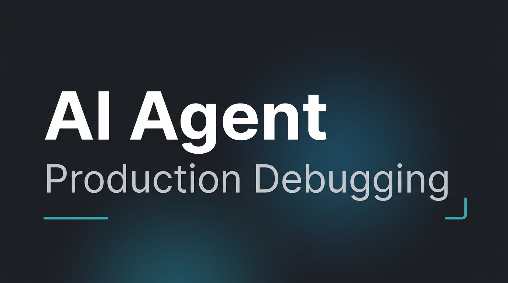

# AI Agent for Production Debugging

[](https://drive.google.com/file/d/1EAx9p0hMC_7Sqg5-8aB63NnDFSjdp-QH/view?usp=sharing)

[](https://drive.google.com/file/d/1EAx9p0hMC_7Sqg5-8aB63NnDFSjdp-QH/view?usp=sharing)

---

A **FastAPI + LangGraph** service that helps debug production-style incidents: you **upload logs**, ask questions in **chat**, and the agent retrieves **relevant log chunks** (vector search), then answers with **evidence (chunk citations)** and **actionable remediation**—not just raw citations.

**Stack:** FastAPI · LangGraph · PostgreSQL + **pgvector** · OpenAI (chat + embeddings) · optional **Redis** (log-search cache) · optional **Mem0** (long-term memory, off by default for latency) · Prometheus / Grafana · optional Streamlit demo.

---

## How it works (end-to-end)

1. **Upload** a `.log` / `.txt` file via `POST /api/v1/logs/upload` (authenticated user, or demo API key).
2. The file is **split into chunks**, each chunk gets an **embedding**, stored in **`log_chunks`** (linked to **`log_batches`** and your user).
3. On **chat**, the agent calls the **`search_logs`** tool: your question is **embedded**, then **similarity search** runs over chunks—but only for **your scoped upload** (see below), returning the **top few** matches.
4. The **LLM** reads those chunks and returns a structured answer: executive summary, evidence with **chunk_id**s, per-issue remediation, prioritized next steps.

**Scoped search:** Log vector search is limited to **your** data—typically the **latest completed upload** for your user, or a specific batch if the client sends **`focus_log_batch_id`** (the Streamlit demo pins the last uploaded batch for that session). This avoids mixing your incident with everyone else’s chunks in the database.

**Redis cache:** Optional. It caches the **exact same** `search_logs` query + filters + batch scope (repeat searches). **Different questions** produce **different** cache keys and still run a fresh retrieval. If `REDIS_URL` is empty, caching is off.

---

## URLs (local defaults)

| URL | Purpose |
|-----|---------|
| http://localhost:8000/docs | **Swagger UI** — try REST APIs interactively |
| http://localhost:8000/redoc | **ReDoc** — read-only API reference |
| http://localhost:8000/api/v1/openapi.json | OpenAPI JSON (codegen / Postman) |
| http://localhost:8501 | **Streamlit demo** — upload → chat + citations (`make demo-up` or `make demo-ui` + API) |
| http://localhost:9090 | **Prometheus** — metrics & PromQL |
| http://localhost:3000 | **Grafana** — dashboards (default login often `admin`; reset password if volume was created earlier) |

API routes live under **`/api/v1`** (e.g. `/api/v1/chatbot/chat`). Health: **`GET /live`** (liveness), **`GET /health`** (readiness + DB).

---

## Prerequisites

- **Python 3.13+**, **[uv](https://docs.astral.sh/uv/)**
- **Docker** (recommended for Postgres + full stack)
- **OpenAI API key**
- **PostgreSQL with pgvector** (Docker image `pgvector/pgvector` is used in Compose)

---

## Quick start (local API)

1. Copy env template and fill secrets:

   ```bash
   cp .env.example .env.development
   ```

   Set at least **`OPENAI_API_KEY`**, **`JWT_SECRET_KEY`**, and **`POSTGRES_*`** so they match your database (see `app/core/config.py` for all options).

2. Start Postgres (published on **`localhost:${POSTGRES_PORT:-5433}`** by default to avoid clashing with a local Postgres on 5432):

   ```bash
   make docker-db
   ```

3. Start the API:

   ```bash
   make start
   ```

   Or: `make docker-db` then `make dev`.

4. Open **http://127.0.0.1:8000/docs**

---

## Demo UI (Streamlit, no JWT)

Requires **`DEMO_API_KEY`** in `.env.development` (Compose defaults match **`demo-local-review-only`**).

**All-in Docker:**

```bash
make demo-up
# http://localhost:8501 — uses X-Demo-API-Key; API at :8000
```

**API on host + Streamlit:**

```bash
make dev          # terminal 1, after docker-db
make demo-ui      # terminal 2 (uses optional demo extra: uv sync --extra demo)
```

---

## Full stack (API + DB + Redis + Prometheus + Grafana)

```bash
make docker-compose-up ENV=development
```

Requires **`.env.development`**. After changing Compose env, use **`docker compose up -d`** so variables apply.

---

## Log ingestion & retrieval (short reference)

| Piece | Description |
|-------|-------------|
| **Chunking** | Windows of lines until `LOG_LINES_PER_CHUNK` or `LOG_CHUNK_MAX_CHARS` is hit (`app/services/log_ingestion.py`). |
| **`search_logs`** | Embedding + pgvector similarity + optional `service` / `level` / time filters. Default **top-k** is small (see `LOG_SEARCH_DEFAULT_TOP_K` / `LOG_SEARCH_MAX_TOP_K`). |
| **Chat body** | Optional **`focus_log_batch_id`** (UUID) to pin which upload to search. |
| **Citations** | `POST /api/v1/chatbot/chat` returns **`citations`** when retrieval runs. |

**Stress ingest (large file):** see `scripts/stress_log_ingest.py` and README history in git for line counts.

**Runbooks (`rag_chunk`):** CLI `scripts/ingest_rag_documents.py`; agent tool **`search_incident_knowledge`**.

---

## Observability

- **App `/metrics`:** HTTP (Starlette Prometheus), **`llm_latency_seconds`**, log-search **`cache_*`** / **`retrieval_latency_seconds`** when those paths run.
- **Prometheus** scrapes the app and **cAdvisor** (containers).
- **Grafana** ships provisioned dashboards under `grafana/dashboards/json/` (LLM latency, log search cache & retrieval).

**Note:** Metrics need **traffic** (your requests count). **`rate(...)`** in Prometheus needs counter movement over the window.

**Local-only:** If the API runs on the host but Prometheus runs in Docker, scrape targets must reach the process (e.g. run the **full Compose** stack so `app:8000` is on the same network).

---

## Makefile highlights

| Target | Action |
|--------|--------|
| `make install` / `uv sync` | Install dependencies |
| `make docker-db` | Postgres (pgvector) only |
| `make dev` / `make start` | API locally |
| `make demo-up` | DB + Redis + app + Streamlit (Compose) |
| `make demo-ui` | Streamlit only (API must be running) |
| `make docker-compose-up ENV=development` | Full stack including monitoring |
| `make monitoring-up` | Prometheus + Grafana only |
| `make eval-rag` | Root-cause RAG eval (see `evals/rag_root_cause/METHODOLOGY.md`) |

---

## Project layout

```
app/api/v1/          # REST: auth, chatbot, logs
app/core/langgraph/  # Agent graph & tools (search_logs, search_incident_knowledge, web search)
app/services/        # DB, LLM, log ingest, log search, Redis
demo/streamlit_app.py
prometheus/          # Prometheus scrape config
grafana/             # Datasources + dashboard JSON
scripts/             # Ingest, stress tests, benchmarks
evals/               # Evaluation harness & reports
```

---

## Troubleshooting (short)

| Issue | What to try |
|-------|-------------|
| DB connection errors | Ensure **`make docker-db`** ran and **`POSTGRES_HOST` / `POSTGRES_PORT`** in `.env.development` match Docker (often port **5433** on the host). |
| `database "…" does not exist` | Run **`make docker-db`** again so the DB is created; check volume/env if you changed `POSTGRES_DB`. |
| Grafana login fails | Admin password is stored in the **Docker volume** from first boot. Reset: `docker compose exec grafana grafana-cli admin reset-admin-password admin` (or wipe the `grafana-storage` volume—see Compose file). |
| Prometheus queries empty | Generate API traffic; **`rate()`** needs counters to increase. Custom metrics (`llm_*`, cache) appear after those code paths run. |
| OpenAPI path | This app serves the schema at **`/api/v1/openapi.json`**, not `/openapi.json`. |

---

## Security

- Do not commit **`.env.development`** or real keys.
- Treat **`DEMO_API_KEY`** like a password on any shared deployment.

---

## Roadmap & evaluation

Phased roadmap (RAG, caching, demo UX, deploy hardening, structured evals) lives in project history; for **root-cause RAG methodology**, see **`evals/rag_root_cause/METHODOLOGY.md`**.

---

## Acknowledgements

Built from a FastAPI + LangGraph template, extended for incident-style log debugging and retrieval-grounded answers.
